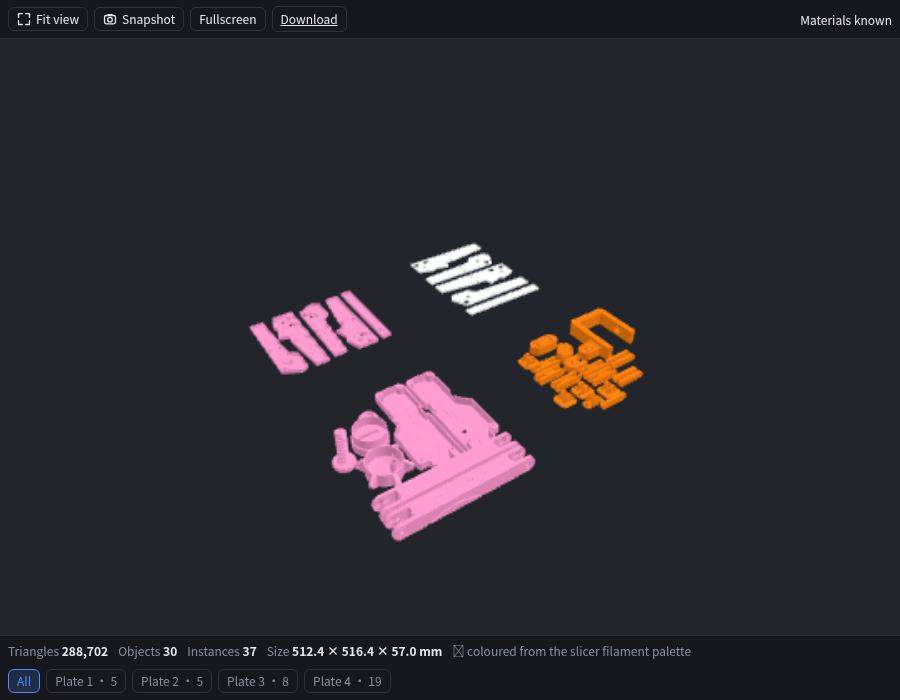

# dsh-3d-preview

[](LICENSE)
[](https://github.com/topics/dsh-plugin)
[](https://github.com/omdsh-dev/DSH-better-sidebar)

**STL / 3MF model preview inside the [dsh-better-sidebar](https://github.com/omdsh-dev/DSH-better-sidebar) file tree — with slicer plates and per-object filament colours.**

Click a `.stl` or `.3mf` in the sidebar's file explorer and orbit, zoom, switch plates and see the
colours your slicer assigned — without leaving the conversation.

[中文说明](README.zh.md)



> A real Bambu Studio project: 4 plates / 30 objects / 37 instances / 288,702 triangles.
> The pink and orange come from `filament_colour` in `Metadata/project_settings.config`.

---

## What it does

| | |
| --- | --- |
| **Formats** | `.stl`, `.3mf` |
| **3MF coverage** | Core spec, the **Production Extension** (external `3D/Objects/*.model` parts), `basematerials` / `colorgroup`, and Bambu/Orca `paint_color` facet paint |
| **Slicer extras** | Plate detection + a plate selector; per-object **filament colours** from `Metadata/project_settings.config` + `Metadata/model_settings.config` |
| **Controls** | drag to orbit · wheel to zoom · right-drag to pan · **Fit view** · **Snapshot** (PNG) · **Fullscreen** |
| **Footer** | triangles · objects · instances · bounding-box size in mm · material confidence · plate chips |
| **Failure modes** | progress overlay with real stage counts; a retry + download overlay when parsing or WebGL fails |

Nothing is invented. When a file carries no material information the model renders in a neutral
grey and the footer says `Materials unavailable` — the same honesty contract the underlying
renderer uses.

## Why this plugin carries extra code

Rendering is delegated to [`@chestnutlabs/gcode-model-renderer`](https://www.npmjs.com/package/@chestnutlabs/gcode-model-renderer)
(MIT, `three`-based, no DOM dependency, runs in a worker). It parses both formats, derives plates
and instancing, and reports progress — this plugin adds three things on top:

1. **The slicer colour id-join.** A Bambu/Orca project declares colours in three places, and the
   extruder table is keyed by the **core** 3MF object id while the mesh lives in an external part
   addressed by a *different* id (`p:path` / `objectid`). The renderer looks the extruder up with
   the external part id, so every object misses and a four-filament project renders grey
   (measured: 0 hits out of 37 placements). `src/client/bambu-colors.ts` redoes the join from the
   zip itself — no fork, no patched dependency — and the same file then colours 30/30 objects.
2. **The chrome.** Progress, retry, plate chips, stats, snapshot, fullscreen.
3. **The plumbing.** Bytes come from better-sidebar's own `/sidebar/file` media route, so this
   plugin contributes no host route at all.

## Install

Needs Node 20+ and a DSH profile with `dsh-better-sidebar` installed.

```bash
# prebuilt tarball from the latest release — seconds, no build step
dsh plugin --profile web add https://github.com/kmyqchy/dsh-3d-preview/releases/latest/download/dsh-3d-preview.tgz

# or straight from this repo — lib/ is committed, so this needs no build either
dsh plugin --profile web add github:kmyqchy/dsh-3d-preview
```

Then **restart `dsh web`**: profile bundles are composed at boot, so a freshly added plugin is not
served until the next start. After the restart, `lib/client.js` is available at
`/plugins/dsh-3d-preview/client.js`.

<details>
<summary>From a local checkout (for development)</summary>

```bash
git clone https://github.com/kmyqchy/dsh-3d-preview.git && cd dsh-3d-preview
npm install --ignore-scripts     # see note below
npm run build
dsh plugin --profile web add link:$PWD
```

`--ignore-scripts` skips native build steps of transitive dev dependencies (`dsh-better-sidebar`
pulls `node-pty`, which we only need for its type declarations). If you never run `npm run
typecheck`, you can drop `dsh-better-sidebar` from `devDependencies` entirely.
</details>

> Not published to npm yet — see [Releasing](#releasing).

## Verified against

| File | Result |
| --- | --- |
| Bambu Studio project `*.3mf`, 4.42 MB | 30 objects / 37 instances / 288,702 triangles / 4 plates (5+5+8+19) / pink-orange palette applied / `Materials known` |
| PrusaSlicer-exported `*.stl`, 864 KB | 1 object / 17,686 triangles / 13.7 × 12.4 × 63.0 mm |

Also checked: `tsc --noEmit` clean; the descriptor registers correctly under the real
`window.__ModuleLoader__` contract (id / exts / fetchStrategy / title / icon); no extension
conflict with the built-in viewers (`image` / `pdf` / `markdown` / `html` / `code`, plus
`binary-download`, whose priority −50 sits below this viewer's 0).

## Adding this viewer to an existing sidebar

Everything is a registry, so a viewer can also be registered from your own plugin:

```ts
import type { Context } from '@deepseek-ai/dsh-client-runtime/client'

export const inject = ['betterSidebar']

export function apply(ctx: Context) {
  ctx.effect(() => ctx.betterSidebar.registerFileViewer({
    id: 'my:model3d',
    exts: ['stl', '3mf'],
    fetchStrategy: 'mediaUrl',
    component: Model3DView,
  }))
}
```

## Limits and out of scope

- **20 MB.** The `/sidebar/file` media route caps responses at `dsh-better-sidebar.mediaLimit`
  (default 20 MB) and serves whole files without `Accept-Ranges`. Files above it show a clear
  error with a **Download** link rather than a broken canvas. The largest file this plugin was
  measured against is a 4.42 MB slicer project.
- **No glTF / STEP / OBJ / PLY.** The engine ships STL and 3MF loaders only. Its loader registry is
  open (`loaders: [...]`), so adding one is a self-contained change.
- **No wireframe / section plane / measurement.** The renderer exposes framing, plate scoping and
  capture, and nothing else.
- **Orbit / zoom / pan only** — the preset API currently implements the isometric view, so there
  is no front/side/top button row.
- **No file-watch reload.** Bytes are fetched over HTTP, so the viewer does not see `mtime`
  changes; re-open the tab after re-exporting.
- **Bambu plate *thumbnails*** (`Metadata/plate_N.png`) are not shown — the plugin renders
  geometry, not the slicer's rendered preview images.
- **UI language** follows `navigator.language`: Chinese for `zh*`, English otherwise. There is no
  in-app switcher.

## Development

```bash
npm run build      # esbuild: lib/index.js (host) + lib/client.js (browser bundle)
npm run watch      # rebuild on change
npm run typecheck  # tsc --noEmit
npm test           # node --test: the colour id-join regression suite
```

`npm test` needs no browser: it builds a minimal Production-Extension project in memory and
asserts that colours land on the right objects. It runs TypeScript sources directly through
Node's type stripping.

### Bundle shape

`lib/client.js` is one lazy-CJS closure registered on `window.__ModuleLoader__`:

```js
window.__ModuleLoader__.load({ id: 'dsh-3d-preview', factory: (require) => { /* … */ return module.exports } })
```

`react` and `react/jsx-runtime` resolve through the shell's frozen module table; **everything
else is inlined**, including `three`. Code splitting is off — the factory's `require` can only
reach module-table entries, so a relative chunk URL could never be fetched. Expect ≈ 560 KB raw
(≈ 150 KB gzip); it is fetched lazily, only when a model file is opened.

Because the artifact is self-contained, this package declares **no runtime dependencies** —
`three`, the model renderer and `fflate` are build-time only, which is why installing it costs
nothing at the registry.

### Releasing

The release workflow builds, tests, packs and attaches `dsh-3d-preview.tgz` to a GitHub Release
whenever a `v*` tag is pushed:

```bash
npm version patch --no-git-tag-version   # bump package.json + CHANGELOG.md
git commit -am "release: v0.1.1"
git tag v0.1.1 && git push --follow-tags
```

The asset name is deliberately **version-free**, so the
`releases/latest/download/dsh-3d-preview.tgz` URL above keeps working across releases. Keep that
name when adding release assets by hand.

Publishing to npm is not set up; if it ever is, the tarball route stays valid.

## Compatibility

Built and verified against `dsh-better-sidebar` 0.19.x and `@chestnutlabs/gcode-model-renderer`
0.20.x with `three` 0.178 (pinned — the engine's peer range is a `0.x` caret).

## License

MIT. `three` (MIT) and `@chestnutlabs/gcode-model-renderer` (MIT) are bundled into the client
artifact; see their repositories for their notices.
